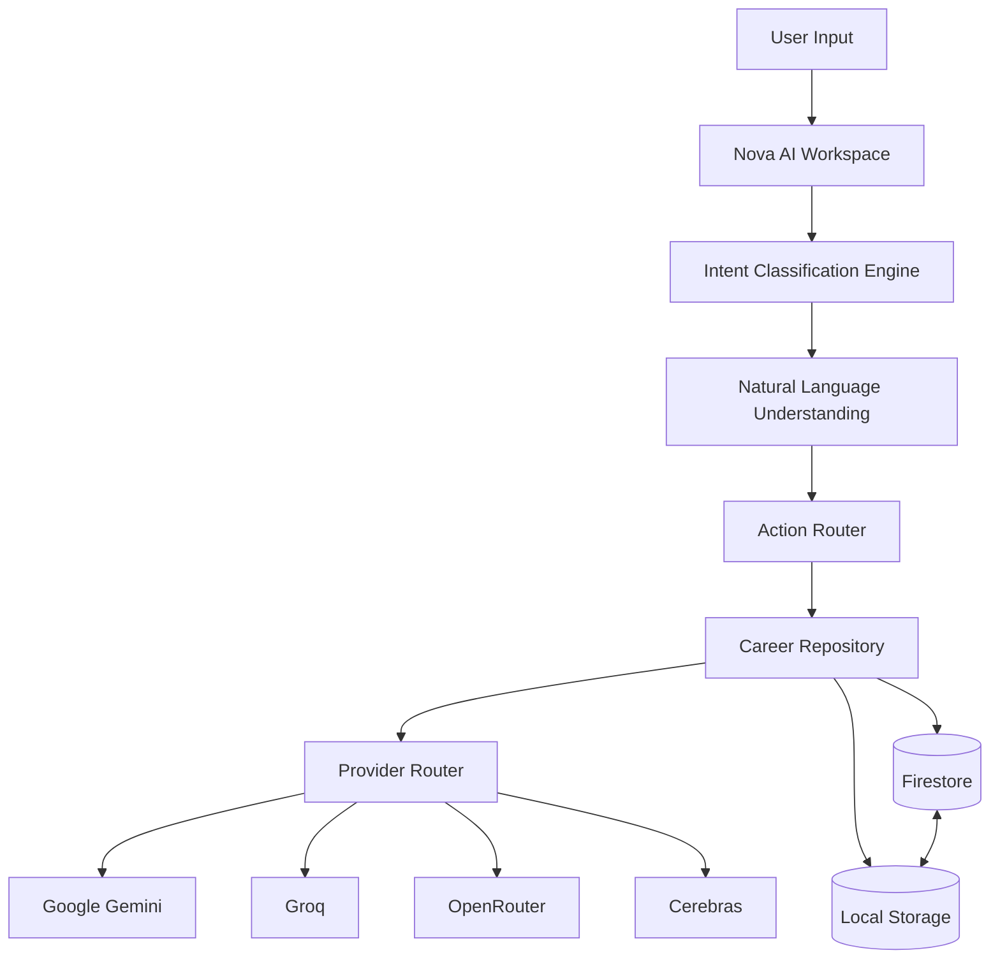

<div align="center">

<br/>

```
   ██████╗ █████╗ ██████╗ ███████╗███████╗██████╗  ██████╗ ███████╗
  ██╔════╝██╔══██╗██╔══██╗██╔════╝██╔════╝██╔══██╗██╔═══██╗██╔════╝
  ██║     ███████║██████╔╝█████╗  █████╗  ██████╔╝██║   ██║███████╗
  ██║     ██╔══██║██╔══██╗██╔══╝  ██╔══╝  ██╔══██╗██║   ██║╚════██║
  ╚██████╗██║  ██║██║  ██║███████╗███████╗██║  ██║╚██████╔╝███████║
   ╚═════╝╚═╝  ╚═╝╚═╝  ╚═╝╚══════╝╚══════╝╚═╝  ╚═╝ ╚═════╝ ╚══════╝
                              L  I  T  E
```

### An AI-powered Career Operating System for students.
### One intelligent workspace. Every career move — tracked, guided, accelerated.

<br/>

[](https://career-os-lite.vercel.app/)
[](https://github.com/Keshav-Jora/CareerOS-Lite)
[](LICENSE)


<br/>

> **CareerOS Lite is not another productivity dashboard.**
> It's an intelligent operating system that understands your career context, routes your intent to the right action, and evolves with you — powered by multi-provider AI, cloud sync, and a persistent career memory layer.

<br/>

[](https://github.com/Keshav-Jora/CareerOS-Lite)
&nbsp;&nbsp;
[](https://career-os-lite.vercel.app/)

</div>

---

## Table of Contents

- [The Problem](#the-problem)
- [Why CareerOS Lite](#why-careeros-lite)
- [Key Features](#key-features)
- [Nova AI](#nova-ai)
- [AI Architecture](#ai-architecture)
- [Tech Stack](#tech-stack)
- [Project Structure](#project-structure)
- [Getting Started](#getting-started)
- [Environment Variables](#environment-variables)
- [Firebase Setup](#firebase-setup)
- [AI Provider Configuration](#ai-provider-configuration)
- [Deployment](#deployment)
- [Screenshots](#screenshots)
- [Roadmap](#roadmap)
- [Contributing](#contributing)
- [Security](#security)
- [License](#license)
- [Author](#author)

---

## The Problem

Students managing their careers live across a fragmented stack:

| Tool | Used For |
|------|----------|
| Spreadsheets | Tracking applications |
| Google Docs | Interview notes |
| Notion | Goals & planning |
| Random AI chats | Career advice |
| Email folders | Offer letters |
| LinkedIn | Opportunity hunting |
| Reminder apps | Deadlines |

**The result:** context gets lost. Progress gets forgotten. Opportunities slip through the cracks.

---

## Why CareerOS Lite

CareerOS Lite collapses the entire career management stack into one AI-powered workspace.

It doesn't just organize — it understands. Nova, the built-in AI assistant, classifies what you're trying to do, routes it to the right module, and acts on it — all while maintaining a persistent memory of your career journey.

The result is a workspace that gets smarter the more you use it.

---

## Key Features

<details>
<summary><strong>Nova AI Workspace</strong></summary>

- Context-aware conversational AI assistant
- Intent classification engine — understands what you actually want
- Natural language understanding across all career domains
- Action routing: Nova can trigger updates across any module
- Career memory: Nova remembers your history, goals, and progress
- Multi-provider routing across Gemini, Groq, OpenRouter, and Cerebras

</details>

<details>
<summary><strong>Career Tracking</strong></summary>

- Opportunity tracker for internships, jobs, hackathons, and fellowships
- Journey timeline for career milestones
- Daily progress logging
- XP and streak system for consistency

</details>

<details>
<summary><strong>Productivity Modules</strong></summary>

- Goals management with progress tracking
- Tasks with priority levels
- Notes hub for interview prep and study notes
- Certificate vault for organizing achievements

</details>

<details>
<summary><strong>Analytics & Insights</strong></summary>

- Career analytics dashboard with charts
- Activity trends via Recharts
- Progress summaries and velocity metrics

</details>

<details>
<summary><strong>Data & Sync</strong></summary>

- Google Authentication via Firebase
- Firestore cloud synchronization
- Offline local storage fallback
- JSON import/export
- Backup and restore

</details>

<details>
<summary><strong>Workspace</strong></summary>

- Admin dashboard
- Settings panel
- Responsive UI (desktop and mobile)
- Dark/Light mode
- Animated transitions via Framer Motion

</details>

---

## Nova AI

Nova is the intelligence layer of CareerOS Lite. It's not a generic chatbot bolted onto a dashboard — it's a purpose-built career assistant with a multi-stage reasoning pipeline.

```
User Input
    │
    ▼
Intent Classification
  → What does the user actually want?
  → Which module does this concern?
    │
    ▼
Natural Language Understanding
  → Extract entities, dates, goals, constraints
    │
    ▼
Action Router
  → Create a goal? Log progress? Track opportunity?
    │
    ▼
Career Repository
  → Pull or push from the user's persistent career memory
    │
    ▼
Provider Router
  → Select the best AI provider for this request type
```

Nova remembers. Every goal you set, every milestone you log, and every opportunity you track becomes part of Nova's context — making every subsequent interaction more accurate and personalized.

---

## AI Architecture



**Multi-provider routing** means CareerOS Lite is not locked to a single AI backend. The provider router selects the optimal model based on request type, latency requirements, and availability — with graceful fallback between providers.

---

## Tech Stack

| Layer | Technology | Purpose |
|-------|-----------|---------|
| **UI Framework** | React 19 | Component architecture |
| **Language** | TypeScript 5.8 | Type safety across the codebase |
| **Build Tool** | Vite 6 | Fast dev server and optimized builds |
| **Styling** | Tailwind CSS 4 | Utility-first responsive design |
| **Animations** | Motion (Framer) | Fluid UI transitions |
| **Icons** | Lucide React | Consistent icon system |
| **Charts** | Recharts | Analytics visualizations |
| **Auth** | Firebase Authentication | Google OAuth |
| **Database** | Firestore | Real-time cloud sync |
| **AI — Primary** | Google Gemini | Core reasoning and generation |
| **AI — Speed** | Groq | Low-latency inference |
| **AI — Routing** | OpenRouter | Model aggregation |
| **AI — Edge** | Cerebras | High-throughput inference |
| **Server** | Express | API proxy for AI providers |
| **Confetti** | Canvas Confetti | Milestone celebrations |

---

## Project Structure

```
CareerOS-Lite/
│
├── src/
│   ├── components/          # All UI components
│   │   ├── dashboard/       # Dashboard widgets
│   │   ├── nova/            # Nova AI workspace
│   │   ├── opportunities/   # Opportunity tracker
│   │   ├── analytics/       # Charts and metrics
│   │   ├── goals/           # Goals management
│   │   ├── tasks/           # Task management
│   │   ├── notes/           # Notes hub
│   │   ├── certificates/    # Certificate vault
│   │   ├── journey/         # Timeline
│   │   ├── admin/           # Admin dashboard
│   │   └── settings/        # User settings
│   │
│   ├── hooks/               # Custom React hooks
│   ├── services/            # Firebase, AI provider services
│   ├── utils/               # Shared utilities
│   ├── types/               # TypeScript interfaces
│   └── main.tsx             # Application entry point
│
├── public/                  # Static assets
├── assets/screenshots/      # Repository screenshots
├── server.js                # Express API proxy
├── .env.example             # Environment variable template
├── vite.config.ts           # Vite configuration
├── tailwind.config.ts       # Tailwind configuration
├── tsconfig.json            # TypeScript configuration
└── package.json
```

---

## Getting Started

### Prerequisites

- Node.js 18+
- npm or yarn
- A Firebase project
- At least one AI provider API key

### Installation

**1. Clone the repository**

```bash
git clone https://github.com/Keshav-Jora/CareerOS-Lite.git
cd CareerOS-Lite
```

**2. Install dependencies**

```bash
npm install
```

**3. Configure environment variables**

```bash
cp .env.example .env
```

Fill in your credentials — see [Environment Variables](#environment-variables) below.

**4. Start the development server**

```bash
npm run dev
```

Open `http://localhost:3000`

**5. Build for production**

```bash
npm run build
```

---

## Environment Variables

Copy `.env.example` to `.env` and populate the following:

```
# .env
```

| Variable | Required | Description |
|----------|----------|-------------|
| `VITE_FIREBASE_API_KEY` | ✅ | Firebase project API key |
| `VITE_FIREBASE_AUTH_DOMAIN` | ✅ | Firebase auth domain |
| `VITE_FIREBASE_PROJECT_ID` | ✅ | Firebase project ID |
| `VITE_FIREBASE_STORAGE_BUCKET` | ✅ | Firebase storage bucket |
| `VITE_FIREBASE_MESSAGING_SENDER_ID` | ✅ | Firebase messaging sender ID |
| `VITE_FIREBASE_APP_ID` | ✅ | Firebase app ID |
| `VITE_GEMINI_API_KEY` | ✅ | Google Gemini API key |
| `VITE_GROQ_API_KEY` | ⚡ | Groq API key (for fast inference) |
| `VITE_OPENROUTER_API_KEY` | ⚡ | OpenRouter API key |
| `VITE_CEREBRAS_API_KEY` | ⚡ | Cerebras API key |

> ⚡ Optional but recommended. The application degrades gracefully when provider keys are missing.

---

## Firebase Setup

**1. Create a Firebase project**

Go to [console.firebase.google.com](https://console.firebase.google.com) and create a new project.

**2. Enable Authentication**

- Navigate to **Authentication → Sign-in method**
- Enable **Google** as a provider

**3. Enable Firestore**

- Navigate to **Firestore Database**
- Create a database in **production mode**
- Set your security rules (see `SECURITY.md`)

**4. Get your config**

- Navigate to **Project Settings → Your apps**
- Register a Web app
- Copy the Firebase config object into your `.env` file

---

## AI Provider Configuration

CareerOS Lite supports four AI providers through a unified provider router. You need at minimum one provider key to use Nova.

| Provider | Best For | Get Key |
|----------|---------|---------|
| Google Gemini | Primary reasoning, long context | [aistudio.google.com](https://aistudio.google.com) |
| Groq | Low-latency responses | [console.groq.com](https://console.groq.com) |
| OpenRouter | Model flexibility and fallback | [openrouter.ai](https://openrouter.ai) |
| Cerebras | High-throughput edge inference | [cloud.cerebras.ai](https://cloud.cerebras.ai) |

The provider router automatically selects the best available provider for each request. If a provider is unavailable, it falls back to the next configured provider.

---

## Deployment

### Deploy to Vercel (Recommended)

**1. Install Vercel CLI**

```bash
npm i -g vercel
```

**2. Deploy**

```bash
vercel --prod
```

**3. Set environment variables**

In the Vercel dashboard, navigate to your project → Settings → Environment Variables and add all variables from your `.env` file.

### Manual Build

```bash
npm run build
# Output will be in /dist
```

Serve the `/dist` directory with any static host (Netlify, Cloudflare Pages, GitHub Pages).

---

## Screenshots

> Screenshots are located in `assets/screenshots/`.

### Dashboard


### Analytics
_Place `assets/screenshots/Analytics.png`_

### Nova AI Workspace
_Place `assets/screenshots/Nova.png`_

### Opportunity Tracker
_Place `assets/screenshots/Opportunities.png`_

### Mobile View
_Place `assets/screenshots/Mobile.png`_

### Admin Dashboard
_Place `assets/screenshots/Admin.png`_

---

## Roadmap

| Status | Feature |
|--------|---------|
| ✅ | Nova AI workspace with intent classification |
| ✅ | Multi-provider AI routing |
| ✅ | Firebase auth and Firestore sync |
| ✅ | Opportunity tracking |
| ✅ | Goals, tasks, notes, certificates |
| ✅ | Career analytics |
| ✅ | Admin dashboard |
| ✅ | JSON import/export |
| ✅ | Offline local storage fallback |
| 🔄 | Resume builder with AI suggestions |
| 🔄 | AI-powered opportunity matching |
| 🔄 | Collaborative career boards (team mode) |
| 🔄 | Calendar integration |
| 🔄 | Email digest of career progress |
| 🔄 | Mobile app (React Native) |

---

## Known Limitations

- AI responses depend on the quality and availability of the configured provider keys.
- Firestore free tier has daily read/write limits — heavy usage may require upgrading the Firebase plan.
- The multi-provider router currently uses sequential fallback, not parallel inference.
- No real-time collaboration between multiple users on the same account.

---

## Contributing

Contributions are welcome. Please read [CONTRIBUTING.md](CONTRIBUTING.md) before opening a pull request.

**Quick start:**

```bash
# Fork the repo, then:
git clone https://github.com/YOUR_USERNAME/CareerOS-Lite.git
cd CareerOS-Lite
npm install
cp .env.example .env
# Add your credentials
npm run dev
```

See [CONTRIBUTING.md](CONTRIBUTING.md) for branching conventions, commit message format, and PR requirements.

---

## Security

See [SECURITY.md](SECURITY.md) for the vulnerability disclosure policy.

**Key practices:**
- API keys are never committed to the repository
- Firebase security rules restrict read/write to authenticated users only
- AI provider keys are proxied through a server-side Express layer — never exposed in the client bundle in production

---

## License

This project is licensed under the [MIT License](LICENSE).

---

## Author

**Keshav Jora**

[](https://github.com/Keshav-Jora)

---

## Acknowledgements

- [Google Gemini](https://deepmind.google/technologies/gemini/) — Primary AI reasoning layer
- [Groq](https://groq.com) — Low-latency inference
- [OpenRouter](https://openrouter.ai) — Multi-model routing
- [Cerebras](https://cerebras.ai) — High-throughput edge inference
- [Firebase](https://firebase.google.com) — Auth and cloud sync
- [Vercel](https://vercel.com) — Deployment platform
- [Tailwind CSS](https://tailwindcss.com) — Styling framework
- [Lucide](https://lucide.dev) — Icon library
- [Recharts](https://recharts.org) — Data visualization

---

<div align="center">

Built by [Keshav Jora](https://github.com/Keshav-Jora)

⭐ If CareerOS Lite is useful to you, consider starring the repository.

</div>
