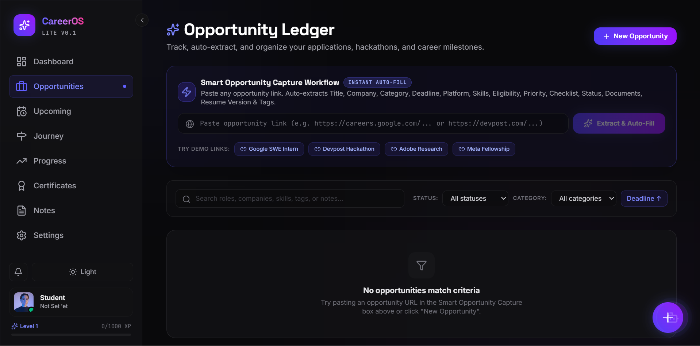
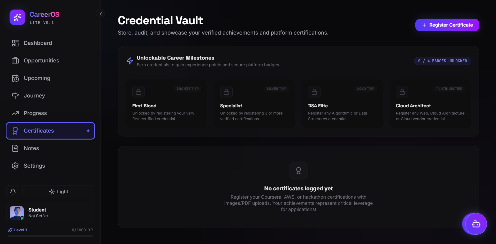
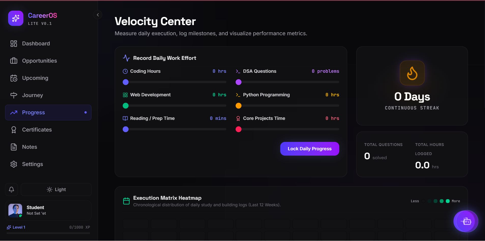

# CareerOS Lite

A frontend-first Career Operating System built for students and aspiring developers to organize internships, hackathons, certifications, coding progress, notes, and career activities in one place.

---

## 🚀 Live Demo

**🌐 Live Website:**  
https://career-os-lite.vercel.app/

**💻 GitHub Repository:**  
https://github.com/Keshav-Jora/CareerOS-Lite

---

## 📖 Project Overview

CareerOS Lite is a responsive productivity dashboard that helps students manage their career journey. It brings together internship tracking, coding progress, certifications, notes, and career milestones into a single, easy-to-use interface.

The application is privacy-focused and stores user data locally in the browser using LocalStorage, allowing users to manage their career information without requiring an account or backend server.

---

## ✨ Features

- 📊 Dashboard with career overview and progress summary
- 💼 Opportunity Tracker for internships, jobs, hackathons and fellowships
- 📅 Upcoming Deadlines and Calendar view
- 🛣️ Journey Timeline for recording career milestones
- 📈 Progress Analytics with charts and activity tracking
- 🏆 Certificate Vault for organizing achievements
- 📝 Notes Hub for interview preparation and study notes
- 🎯 XP & Streak system for motivation and consistency
- 📱 Fully Responsive UI for desktop and mobile devices
- 💾 LocalStorage-based data persistence
- 🤖 Rule-Based Assistant for productivity guidance

---

## 📸 Screenshots

### Dashboard



### Certificates



### Progress



---

## 🛠️ Tech Stack

- React 18
- TypeScript
- Vite
- Tailwind CSS
- Motion
- Lucide React
- Recharts
- Canvas Confetti

---

## 🏗️ Architecture

CareerOS Lite follows a modular frontend architecture.

```
React UI
    │
    ▼
Custom Hooks
    │
    ▼
Service Layer
    │
    ▼
LocalStorage
```

The project separates UI components, business logic, and storage to keep the codebase organized and maintainable.

---

## ⚙️ Installation

### Clone the repository

```bash
git clone https://github.com/Keshav-Jora/CareerOS-Lite.git
cd CareerOS-Lite
```

### Install dependencies

```bash
npm install
```

### Start the development server

```bash
npm run dev
```

Open:

```
http://localhost:5173
```

### Build for production

```bash
npm run build
```

---

## 📂 Project Structure

```
CareerOS-Lite
│
├── assets/
│   └── screenshots/
├── src/
│   ├── components/
│   ├── hooks/
│   ├── services/
│   ├── utils/
│   └── main.tsx
│
├── public/
├── package.json
└── README.md
```

---

## 🔒 Privacy

CareerOS Lite stores user data locally in the browser using LocalStorage.

No user data is transmitted to external servers.

Each user's data remains on their own device.

---

## 📌 Current Status

CareerOS Lite is currently a frontend-first application designed for personal career management with local browser storage.

---

## 🤝 Contributing

Contributions are welcome.

1. Fork this repository.
2. Create a feature branch.

```bash
git checkout -b feature/your-feature
```

3. Commit your changes.

```bash
git commit -m "Add your feature"
```

4. Push your branch.

```bash
git push origin feature/your-feature
```

5. Open a Pull Request.

---

## 📄 License

This project is licensed under the MIT License.

---

## 👨‍💻 Author

**Keshav Jora**

GitHub:
https://github.com/Keshav-Jora
